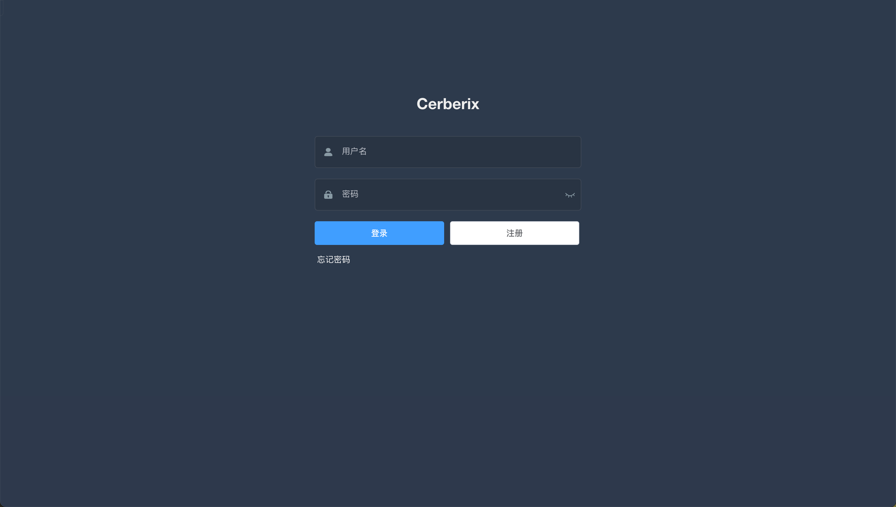
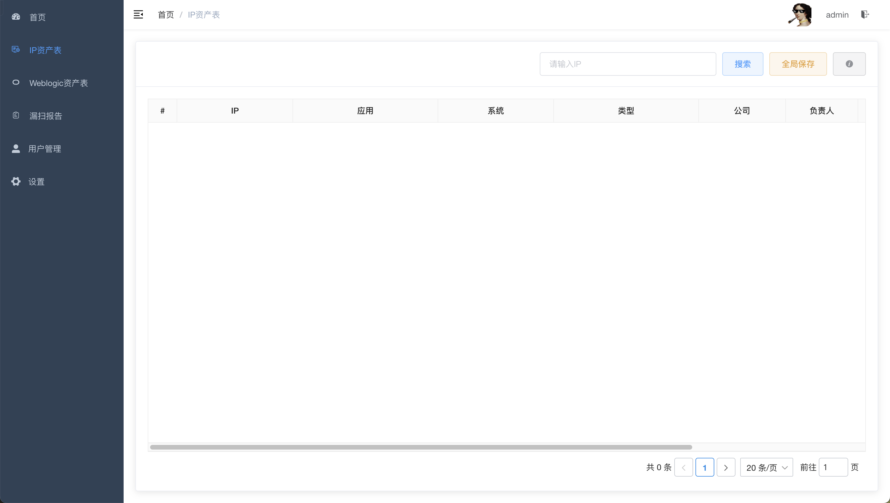
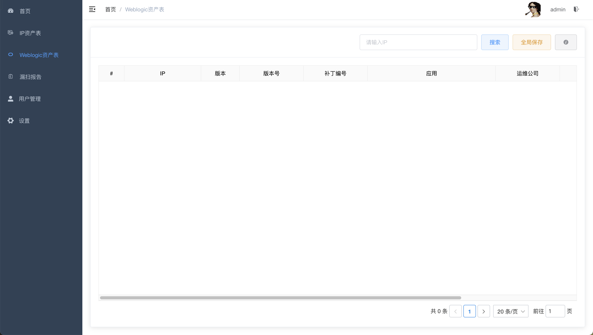
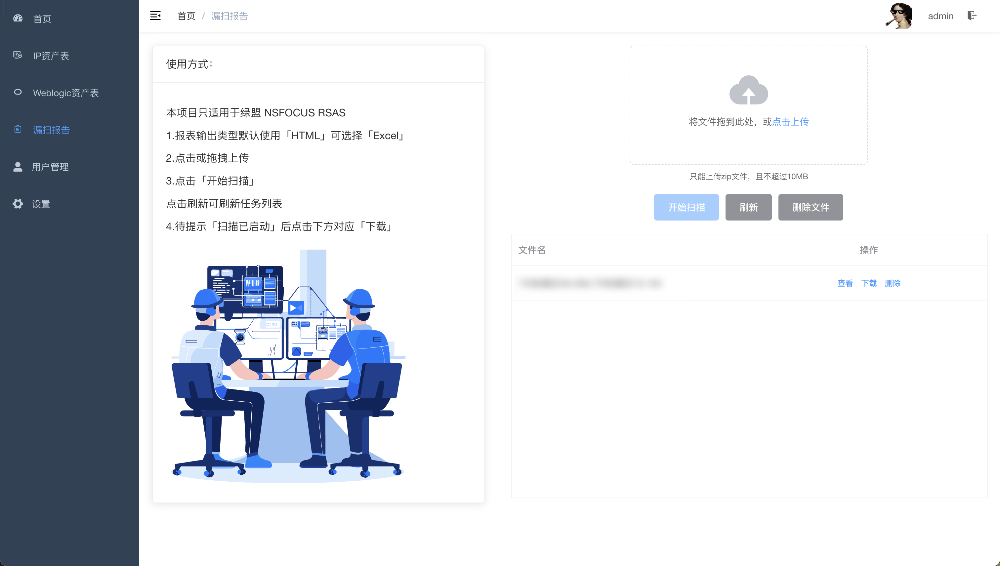
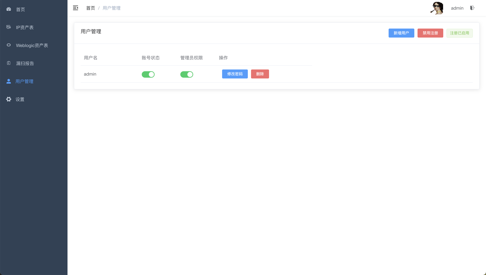
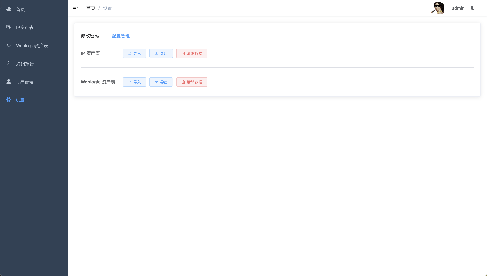

# [Cerberix](https://github.com/47th0a/Cerberix)

Cerberix 是一个 IP 资产管理、漏洞管理和漏扫报告项目。项目的设计初衷是为了优化内部工作流程，省去繁琐的 IP 关联查找等功能。

## 目录
- [主要特性](#主要特性)
- [技术栈](#技术栈)
- [项目截图](#项目截图)
- [待开发功能](#待开发功能)
- [关于作者](#关于作者)

## 主要特性
- **首页**：系统概览和仪表盘。
- **IP 页**：IP 资产的管理和关联。
- **Weblogic 页**：Weblogic 资产的管理和关联。
- **漏扫结果页**：查看和管理漏扫报告。
- **用户管理页**：管理用户角色和权限。
- **设置页**：系统配置和设置。

## 技术栈
- **前端**：Vue.js
- **后端**：Python, Flask
- **数据库**：MongoDB
- **容器化**：Docker

## 截图

## 待开发功能

- ~~账号权限~~
- ~~数据编辑~~

## 关于作者
Cerberix是一个个人项目，由[47th0a](https://github.com/47th0a)本人独立开发。
